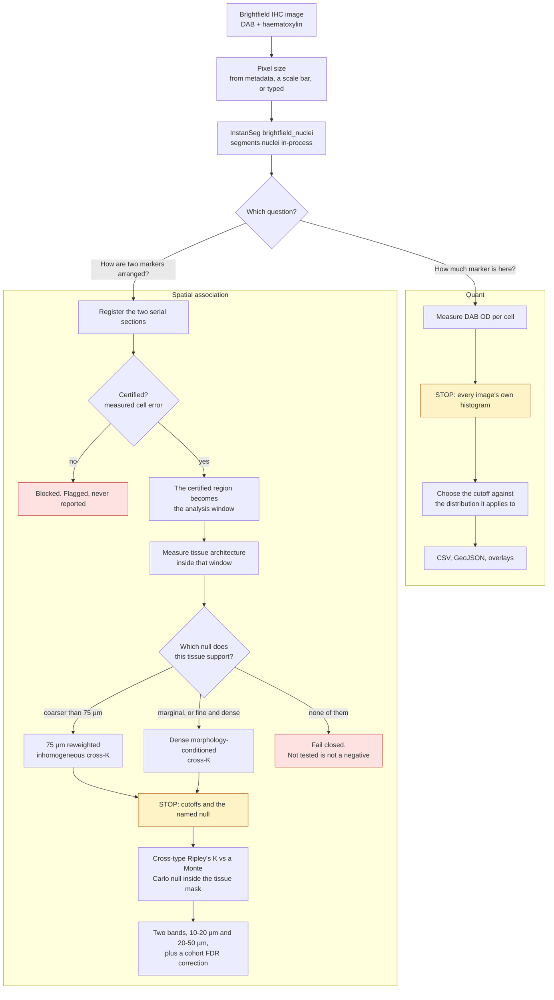
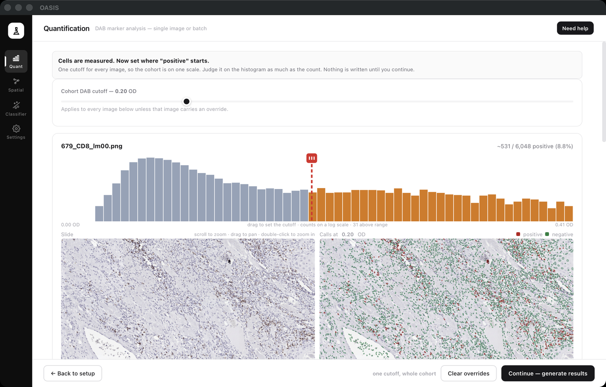
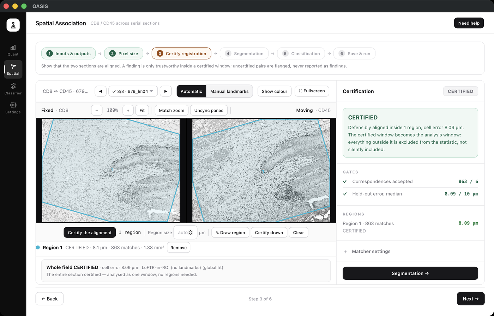
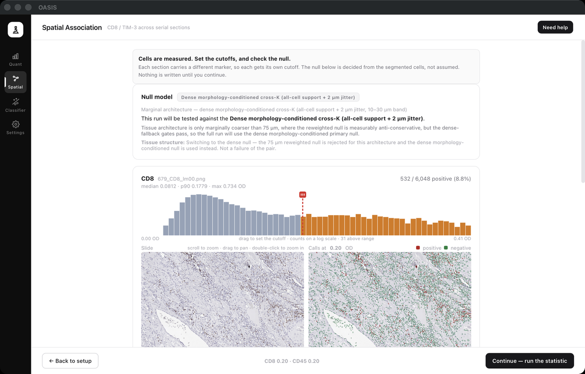
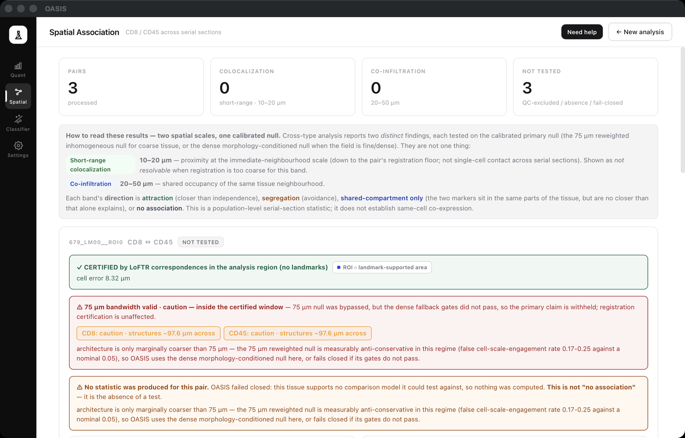

# OASIS

Desktop and command-line tooling for immunohistochemistry. OASIS segments cells in
H-DAB stained brightfield images, decides which of them are positive, and measures how
two markers are arranged relative to each other across serial sections.

It exists because counting cells by eye is slow and two people rarely agree on the
answer. Microscope settings stay on your machine, and nothing about the design asks you
to commit image data, API keys, or local paths.

The part worth knowing before you start: OASIS would rather tell you it could not answer
than answer badly. Registration that is not certified blocks the statistic. Tissue whose
architecture no null model fits is reported as not tested, which is a different thing
from no association.

## What it does

- Counts DAB-positive cells in brightfield IHC, one image or a whole folder.
- Segments with the InstanSeg `brightfield_nuclei` model, in-process. No external tool
  to install, no Groovy, no headless QuPath.
- Cuts positivity on a fixed DAB optical density, or on a cytoplasmic ring for
  membranous markers, or on a small classifier you train by clicking cells.
- Writes one CSV results table per run, one row per image, with each image's quality
  warnings attached to its own row rather than pooled at the bottom.
- Exports GeoJSON cell boundaries and draws overlays you can check against the slide.
- Measures spatial association between two markers on serial sections, at the level of
  populations. It does not claim single-cell co-expression, which serial sections
  cannot establish.

## How it works



The two amber boxes are the point. Both pipelines stop before they spend anything, at
the moment a decision has to be made, and show you what that decision is being made
against. The two red boxes are the other point: there are states in which OASIS produces
no number at all, and says so.

## What it looks like

Both workflows are wizards, one step per decision.

| | |
|---|---|
|  |  |
| **Quant stops on the histogram.** You set the cutoff against the distribution it will be applied to, and only then is anything written. | **Spatial will not report until the sections are aligned to a measured error.** The certified region becomes the analysis window; everything outside it is excluded rather than quietly included. |
|  |  |
| **Every pair carries its own null.** These three serial CD8/CD45 fields measure just above the 75 µm bandwidth, so the run switches to the dense null instead of trusting the reweighted one. | **The result names the null it was tested against.** Certified at 8.32 µm, with two of the three pairs surviving the cohort FDR correction. |

Every tab has a **Need help** button that opens the same pictures beside the step they
belong to.

## Requirements

Python 3.10 or newer. The InstanSeg `brightfield_nuclei-0.1.1` weights ship with OASIS,
so there is nothing to download.

### Platform support

| Platform | Prebuilt app | From source |
|---|---|---|
| macOS, Apple Silicon (arm64) | ✅ | ✅ |
| **macOS, Intel (x86_64)** | ❌ | ❌ |
| Windows x64 | ✅ | ✅ (see note) |
| Linux x86_64 | ✅ | ✅ (see note) |
| Linux aarch64 | ❌ | ✅ (see note) |

Each bundle is built on its own runner, because PyInstaller cannot cross-compile, and
every one is smoke-tested frozen before release: the bundle segments the model's own
reference image and the cell count is checked. A bundle that builds but cannot run does
not reach a release. Linux aarch64 has no prebuilt asset only because there is no runner
for it. Installing from source works there.

**Intel Macs are not supported and there is no workaround.** PyTorch no longer publishes
macOS x86_64 wheels; its macOS wheels are arm64 only. With no PyTorch wheel there is no
segmenter, so neither the app nor a source install can run. That is an upstream
constraint. It would change only if PyTorch resumed Intel Mac builds.

Running from source on Windows or Linux needs one extra step, because `pywebview` uses a
different GUI backend on each:

- Windows: `pip install pythonnet`. The WebView2 Runtime is built into Windows 11 and
  installable on Windows 10.
- Linux: install the GTK backend's system packages. On Debian or Ubuntu that is
  `sudo apt install python3-gi python3-gi-cairo gir1.2-gtk-3.0 gir1.2-webkit2-4.1`

The command-line pipeline needs none of this. It has no GUI dependency, and
`device: mps` falls back to CPU on non-Apple hardware.

## Setup

```bash
python -m venv .venv
source .venv/bin/activate
pip install -r requirements.txt
cp config.example.yaml config.yaml
```

Then edit `config.yaml` with local paths for `input_dir`, `output_dir`,
`dashboard_dir`, and `instanseg_model`. The desktop app keeps its own setup in
`~/.ihc_analyzer/`.

## Running it

The desktop app:

```bash
python app.py
```

Quantification from the command line:

```bash
python run_pipeline.py --config config.yaml
```

That scans `input_dir` for supported images, segments them in-process, and writes the
results table and per-image exports to `output_dir`. Overlays and run logs go to
`dashboard_dir`.

### Spatial association

Launch it from the desktop UI, or from the command line with a config that includes
`spatial_pairs`:

```bash
python run_pipeline.py --config config.yaml --mode spatial
```

`--mode coloc` still works as a deprecated alias.

Pairs are segmented stain by stain and registered into a shared coordinate space.
Association is then measured with the cross-type Ripley's K and pair-correlation g(r)
functions against a Monte Carlo null bounded by the tissue mask, with a global DCLF
envelope test for significance. This is a population statistic. It does not assert
single-cell co-expression, and serial sections could not establish that anyway: different
Z-planes, markers that are not restricted to one lineage, and nuclear-versus-membrane
compartments.

**Which null model gets used is decided from the tissue, not assumed.** OASIS estimates
the architecture scale inside the certified window and picks accordingly. Coarse
architecture gets the 75 µm intensity-reweighted inhomogeneous null. Architecture that
is fine and dense, or only marginally coarser than the bandwidth, gets the dense
morphology-conditioned null instead: B\* sampled from marker-independent all-cell
detections in the reference section inside the certified window, plus 2 µm jitter,
tested over the 10-30 µm DCLF band. That marginal case is not a nicety. Measured, the
reweighted null's false engagement rate there reaches 0.17 to 0.25 against a nominal
0.05, while the dense null stays at 0.00.

The dense null runs only when registration is certified, a real analysis window exists,
and the minimum positive and support counts pass. When they do not, the pair fails
closed and the reason is recorded in the JSON and in the UI. Sparse fields are never
relabelled as dense; they stay not tested. The fallback is also checked for scaffold
sensitivity: on the Keren TNBC pseudo-IHC pilot, p13 and p16 hold up under
external-scaffold substitution and 33 perturbations, while borderline p32 is correctly
flagged as scaffold-sensitive. Report dense calls near that boundary with the
sensitivity in view.

## Validation and reproducibility

Every scientific claim has a registered validation behind it, runnable from the desktop
**Validation** tab or the command line. Same runner, same report bundles.

```bash
python -m validation.run --list                 # list validations + dataset/preflight status
python -m validation.run cross_k                  # run one validation
python -m validation.run all --tier instant        # run all no-dataset statistical checks
python -m validation.datasets.verify              # dataset presence + checksum table
python -m validation.datasets.acquire --apply       # consolidate datasets into the tree
```

Each run writes a bundle to `validation_reports/<id>/<timestamp>/`: a `report.json` with
metrics, status, expected result, software and git SHA, dataset checksums and timing,
plus `run.log` and any plots. They are meant to be usable as supplementary material.

Datasets live in one tree at `validation_data_dir`, by default
`~/oasis_validation_datasets`, overridable in `~/.ihc_analyzer/setup.yaml` or via the
`IHC_VALIDATION_DATA_DIR` environment variable. Raw inputs are kept separate from
generated outputs, and each dataset carries a README, a licence, and a checksum. No
dataset is ever committed. See `validation/datasets/README.md` and `datasets.yaml` for
sources, licences, and citations. Restricted datasets such as HNSCC/TCIA are documented
but never redistributed. A missing dataset skips its validation with a message naming
the dataset and where to get it.

The QuPath and Groovy segmentation arm was removed after being validated as equivalent
on a 598-image benchmark (`research/ihc.md` §7). The code is kept in `legacy/qupath/`
for reference.

## Configuration

`config.example.yaml` has safe defaults and placeholders. Do not commit your own
`config.yaml`; it may carry private paths, sample names, or output locations.

The fields that matter most:

- `dab_threshold`: DAB mean OD above which a cell is called positive.
- `default_pixel_size`: microns per pixel, used when no image metadata overrides it.
- `device`: InstanSeg device, such as `mps`, `cuda`, or `cpu`.
- `cleanup_intermediates`: delete CSV, GeoJSON, logs, and metadata once the summary
  outputs exist.

`.gitignore` already excludes local secrets, virtual environments, generated scripts,
analysis outputs, and large microscopy formats. Keep raw data and machine-specific files
outside Git.

## Building the desktop bundle

```bash
./packaging/build.sh
```

That produces `dist/OASIS.app`, about 1.0 GB unpacked and 339 MB zipped. The bundle is
a release asset and is never committed. `packaging/OASIS.spec` holds the freeze recipe
and the bundle-only failures it works around.

`build.sh` ends by running the frozen bundle headless against the model's own reference
image and checking the cell count, because "it built" and "it works" are separate claims.
Every bundle-only failure so far has produced a green build and a broken app.

### Opening an unsigned build on macOS

OASIS is not code-signed or notarized, for the same reason QuPath is not: it needs a paid
Apple Developer membership. macOS will refuse to open it the first time.

- macOS 15 and later report the app as damaged. Open **System Settings → Privacy &
  Security**, scroll to the message about OASIS, choose **Open Anyway**, and confirm.
- macOS 14 and earlier: right-click the app, choose **Open**, and confirm at the
  unidentified-developer prompt.

That is Gatekeeper policy for unsigned applications, not a sign the download is corrupt.
`build.sh` prints the signing and notarization commands for when a certificate is
available.

## Contributing, issues, and support

- Report a bug or ask a question:
  <https://github.com/smukilan9-ship-it/OASIS/issues>
- [CONTRIBUTING.md](CONTRIBUTING.md), which has extra requirements for any change that
  affects a reported number.
- [CODE_OF_CONDUCT.md](CODE_OF_CONDUCT.md)

Please do not attach patient images or identifiable data to issues.

## Licence and citation

OASIS is released under the MIT License ([LICENSE](LICENSE)).

The bundled InstanSeg `brightfield_nuclei` weights in `models/` are Apache-2.0 and carry
their own attribution and citation requirements, including the licences of the datasets
they were trained on. See [models/NOTICE.md](models/NOTICE.md). Work that uses OASIS's
segmentation should cite InstanSeg as well as OASIS.
